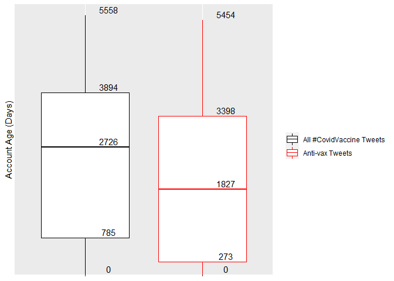

I utilized ’s dataset on Kaggle, which compiled

As the #CovidVaccine tweets were defined by their use of the hashtag, I
looked to the hashtags to find anti-vaccine sentiment. I discovered many
popular anti-vax tags, including #Plandemic, #COVID1984, and #CovidHoax.
I used these tags to identify which tweets contained anti-vaccine
sentiment, and attempted to find anything else that made them different
from your average #CovidVaccine tweet. One striking discovery was that,
on average, the accounts that make these anti-vax tweets are
significantly newer than your average account using the hashtag. With
the date of the tweet’s posting, and the date of each account’s
creation, I can find the “age at posting” for each tweet, and I found a
median age of 2726 days, or just under seven and a half years. However,
when looking at anti-vax tweets, the median age is 1827, or around five
years. Even more strikingly, I found that, when looking at all
#CovidVaccine tweets, the first quartile of account age is a tad over 2
years. However, when looking at anti-vax tweets, the first quartile is
only 9 months. This shows that a significant proportion of these
anti-vax ideas are being propagated by remarkably young accounts,
raising worrying questions about the true popularity of these ideas, as
users may be making multiple accounts, or even using bots to promote
these hashtags.

<table class=" lightable-classic" style="font-family: Cambria; width: auto !important; margin-left: auto; margin-right: auto;">
<caption>
Proportion of Tweets with Conspiracy Hashtags
</caption>
<tbody>
<tr>
<td style="text-align:left;">
All #CovidVaccine Tweets
</td>
<td style="text-align:right;">
0.001
</td>
</tr>
<tr>
<td style="text-align:left;">
Anti-vax Tweets
</td>
<td style="text-align:right;">
0.038
</td>
</tr>
</tbody>
</table>

The COVID-19 pandemic brought unprecedented social upheaval with it.
Early months were fraught with confusion and misinformation, including
misleading and even outwardly deceptive statements by the Trump
administration, and our former president himself. In the last decade,
conspiratorial ideas have been brought to the forefront of American
politics, and the fears and difficulties of the pandemic only fueled
this paranoia. Because of this, I again looked at these anti-vaccine
tweets, and found that anti-vaccine ideas, recently espoused by cultural
giants like Nicki Minaj, Kanye West, and most recently Joe Rogan, are
strongly linked to other, even more dangerous ideas. Only 0.1%, or 1 in
one thousand #CovidVaccine tweets contain conspiracy hashtags like
#Eugenics and #PuppetState. However, anti-vax tweets contain these
hashtags nearly 4% of the time, an increase of 3760%. Although not
necessarily surprising, it’s important to acknowledge the potential
anti-vax ideas have to introduce and normalize more harmful and
dangerous worldviews.
